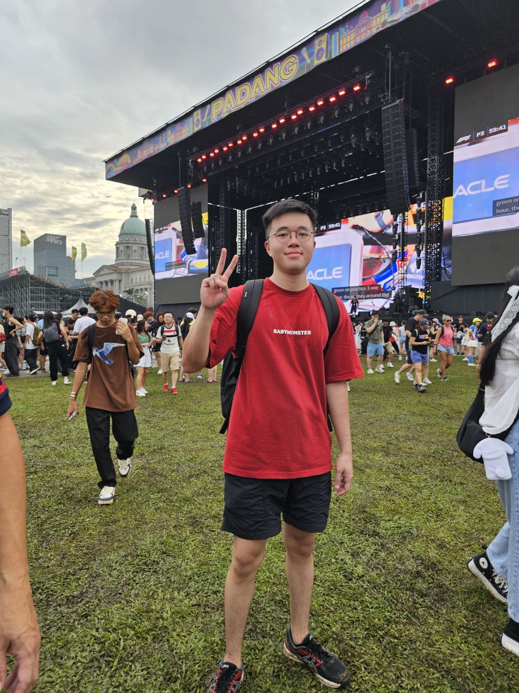
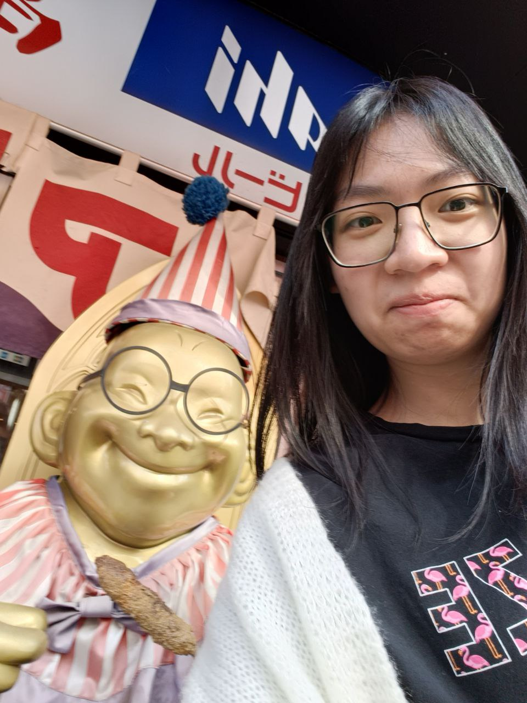

# About Us

We are a team based in the [School of Computing, National University of Singapore](http://www.comp.nus.edu.sg).

You can reach us at the email `seer[at]comp.nus.edu.sg`

## Project team

### Stanley Beh

[[github](https://github.com/ziliangstanley)]
[[portfolio](team/clifong.md)]

* Role: Project maker

### Clif ong

[[github](http://github.com/clifong)]
[[portfolio](team/johndoe.md)]

* Role: Team Lead
* Responsibilities: UI

### Johnny Doe

[[github](http://github.com/johndoe)] [[portfolio](team/johndoe.md)]

* Role: Developer
* Responsibilities: Data

### Jensen Teo

[[github](http://github.com/jensen188)]
[[portfolio](team/jensen188.md)]

* Role: Developer
* Responsibilities: Dev Ops + Threading

### San Shao Qian

[[github](https://github.com/SanShaoQian)]
[[portfolio](team/sanshaoqian.md)]

* Role: Developer
* Responsibilities: Data
