# BiteBook User Guide

BiteBook is a **desktop app for restaurant owners to manage customer details, optimized for use via a  Line Interface** (CLI) while still having the benefits of a Graphical User Interface (GUI). If you can type fast, BiteBook can get your customer management tasks done faster than traditional GUI apps.

<!-- * Table of Contents -->
<page-nav-print />

--------------------------------------------------------------------------------------------------------------------

## Quick start

1. Ensure you have Java `17` or above installed in your Computer. 
   **Mac users:** Ensure you have the precise JDK version prescribed [here](https://se-education.org/guides/tutorials/javaInstallationMac.html).

1. Download the latest `.jar` file from [here](https://github.com/AY2425S2-CS2103T-T08-1/tp/releases).

1. Copy the file to the folder you want to use as the _home folder_ for BiteBook.

1. Open a command terminal, `cd` into the folder you put the jar file in, and use the `java -jar BiteBook.jar` command to run the application. 
   A GUI similar to the below should appear in a few seconds. Note how the app contains some sample data. 
   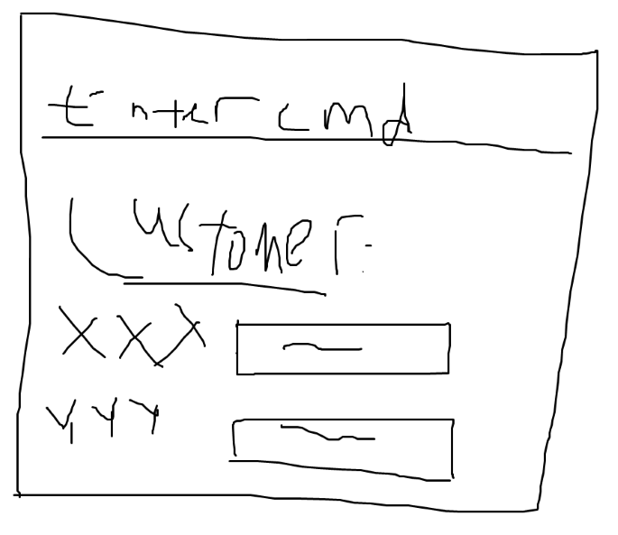

1. Type the command in the command box and press Enter to execute it. e.g. typing **`help`** and pressing Enter will open the help window. 
   Some example commands you can try:

    * `list` : Lists all contacts.
    * `add n/John Doe p/98765432` : Adds a contact named `John Doe` to the Address Book.
    * `delete 3` : Deletes the 3rd contact shown in the current list.
    * `findOrders Chicken rice` : Finds all customer who ordered chicken rice.
    * `findPreferences no salt` : Finds all customer who prefer to not have salt.
    * `savePreference 1 s/no salt` : Adds the preference "no salt" for customer in the 1st position
    * `tag 2 t/VIP` : Tags the 2nd customer in contact book as VIP
    * `addOrder 1 d/Chicken Rice` : Adds "Chicken Rice" to the 1st customer's past orders
    * `clear` : Deletes all contacts.
    * `exit` : Exits the app.

1. Refer to the [Features](#features) below for details of each command.

--------------------------------------------------------------------------------------------------------------------

## Understanding Callout Boxes

You will be encountering these various callout boxes throughout this guide. These boxes provide important information about the various commands or functions.

> 📝 **Note Box**
> 
> Provides clarifications on a feature or command. Look out for these when you need more information about how something works.
 
> 💡 **Tip Box** 
>
> Offers helpful tips and best practices. These help you use BiteBook more effectively.

> ❗ **Warning Box** 
> 
> Highlights possible warnings or potential errors. Pay special attention to these to avoid encountering these problems.

> ⚠️ **Danger Box** 
> 
> Indicates critical warnings or irreversible actions. Always read these carefully before proceeding.

--------------------------------------------------------------------------------------------------------------------

## Features

> 📝 **Note**
>
> **Notes about the command format:** 
>
> * Words in `UPPER_CASE` are the parameters to be supplied by the user. 
  e.g. in `add n/NAME`, `NAME` is a parameter which can be used as `add n/John Doe`.
>
> * Items in square brackets are optional. 
  e.g `n/NAME [t/TAG]` can be used as `n/John Doe t/VIP` or as `n/John Doe`.
>
> * Parameters can be in any order. 
  e.g. if the command specifies `n/NAME p/PHONE_NUMBER`, `p/PHONE_NUMBER n/NAME` is also acceptable.

> 💡 **Tip**
>
> Extraneous parameters for commands that do not take in parameters (such as `help`, `list`, `exit` and `clear`) will be ignored. 
  e.g. if the command specifies `help 123`, it will be interpreted as `help`.

> ❗ **Warning**
> 
> * For any commands that require the`INDEX` parameter, note that this `INDEX` refers to the index number shown in the **displayed person list**.
> * If you are using a PDF version of this document, be careful when copying and pasting commands that span multiple lines as space characters surrounding line-breaks may be omitted when copied over to the application.

### Viewing help : `help`

Shows a message explaining how to access the help page.

Format: `help`

### Adding a customer: `add`

Adds a customer to the address book.

Format (In any order): `add n/NAME p/PHONE_NUMBER [t/TAG] [s/PREFERENCE]`

> 📝 **Note**
>
> * Two people with the same name and phone number are considered duplicated. This is not allowed.
> * Phone number is at least **8 digits long**.

> 💡 **Tip**
> 
> * A person can only have at most **1** tag and **1** preference.
> * There is no maximum phone number length.

> ❗ **Warning**
>
> * We only allow the use of alphanumeric characters in our names, 
> so avoid using characters such as `/` or `'` in your names.
> Use nicknames or other given names if your full legal name contains such characters.
> * Any spaces before and after the name provided will be trimmed. 
> However, excess spaces in between words within the name will be kept, so do be careful when inputting the names.

Examples:
* `add n/John Doe p/98765432 t/VIP s/No salt`
* `add n/John Doe t/VIP p/98765432 s/No salt`

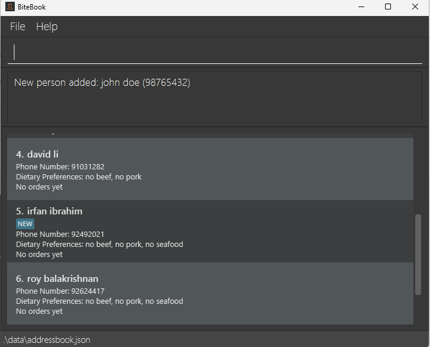

### Listing all customers : `list`

Shows a list of all customers in the address book.

Format: `list`

### Finding customers by name: `find`

Finds customers whose names contain any of the given keywords.

Format: `find KEYWORD [MORE_KEYWORDS]`

> 📝 **Note**
> * The search is case-insensitive. e.g `hans` will match `Hans`
> * The order of the keywords does not matter. e.g. `Hans Bo` will match `Bo Hans`
> * Only the name is searched.
> * Only full words will be matched e.g. `Han` will not match `Hans`
> * Persons matching at least one keyword will be returned (i.e. `OR` search).

Examples:
* `find John` returns `john` and `John Doe`
* `find alex david` returns `Alex Yeoh`, `David Li` 

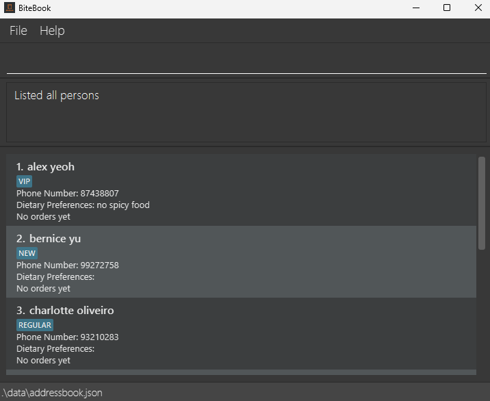

### Deleting a customer : `delete`

Deletes the specified customer from the address book.

Format: `delete INDEX`

> 📝 **Note**
>
> * Deletes the customer at the specified `INDEX`.
> * The index **must be a positive integer** 1, 2, 3, …​

> ❗ **Warning**
>
> * The index refers to the index number shown in the displayed person list.
> * Hence, the index **must be a valid index (in range)** in the current list of displayed customers.

Examples:
* `list` followed by `delete 2` deletes the 2nd person in the address book.
* `find Betsy` followed by `delete 1` deletes the 1st person in the results of the `find` command.

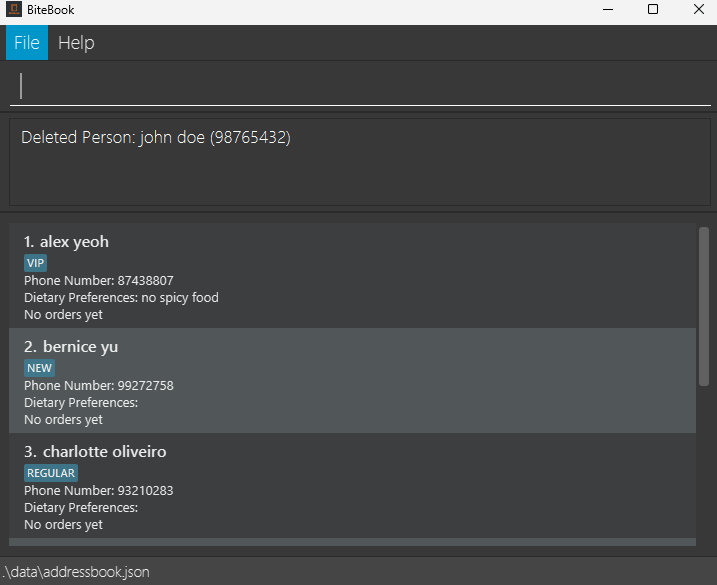

### Tagging a customer : `tag`

Tags a customer in the address book as VIP, Regular or New.

Format: `tag INDEX t/TAG`

> 📝 **Note**
>
> * Tags the customer at the specified `INDEX`.
> * The index **must be a positive integer** 1, 2, 3, …​
> * Existing tags of the person will be removed and replaced by the input tag.
> * If multiple tags are provided, only the last tag will be saved.
 
> 💡 **Tip**
> 
> `tag 1 t/` or `tag 1` will untag the first displayed customer.

> ❗ **Warning**
>
> * The index refers to the index number shown in the displayed person list.
> * The full list of customers is shown after using this command.
> * Hence, the index **must be a valid index (in range)** in the current list of displayed customers.

Examples:
* `list` followed by `tag 4 t/VIP` tags the 4th person in the address book as VIP.
* `tag 1 t/Regular t/VIP` tags the 1st person in the address book as VIP.

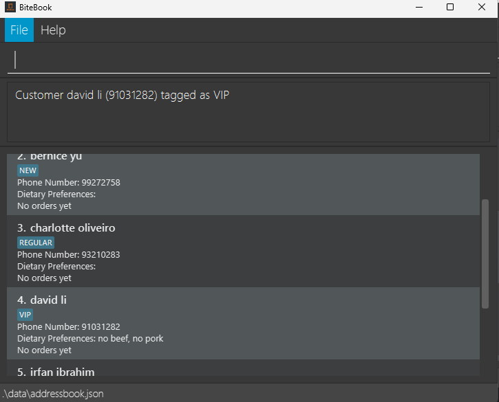

### Finding customers by tag : `findTag`

Finds all customers that has the tag that matches

Format: `findTag TAG`

> 📝 **Note**
> * Displays all customers that are tagged as `TAG`.
> * The `TAG` must be one of the following: VIP, Regular, New.
> * The search is case-insensitive. e.g. `ReGuLaR` will match with `Regular`.

Examples:
* `findTag VIP` will list all customers that have been tagged `VIP`.

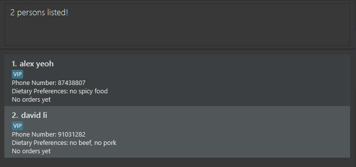

### Storing a customer's dietary preferences : `savePreference`

Stores a customer's dietary preferences in the address book.

Format: `savePreference INDEX s/PREFERENCE`

> 📝 **Note**
> * Stores the dietary preference of the person at the specified `INDEX`.
> * The index **must be a positive integer** 1, 2, 3, …​
> * The dietary preference must be a non-empty string and alphanumeric.

> 💡 **Tip**
> * The dietary preference is case-insensitive. e.g. `No SeAfoOD` will match `no seafood`
> * If multiple dietary preferences are provided, only the last preference will be saved.

> ❗ **Warning**
> * The index refers to the index number shown in the displayed person list.
> * The dietary preference is space-sensitive. e.g. `no seafood` will not match `noseafood` or `no    seafood`
> * If the customer has the same dietary preference, it will not be added again.

Examples:
* `list` followed by `savePreference 2 s/no beef` stores the dietary preference of the 2nd person in the address book as `no beef`.
* `savePreference 1 s/no beef s/no fish` will only save "no fish" to the customer.

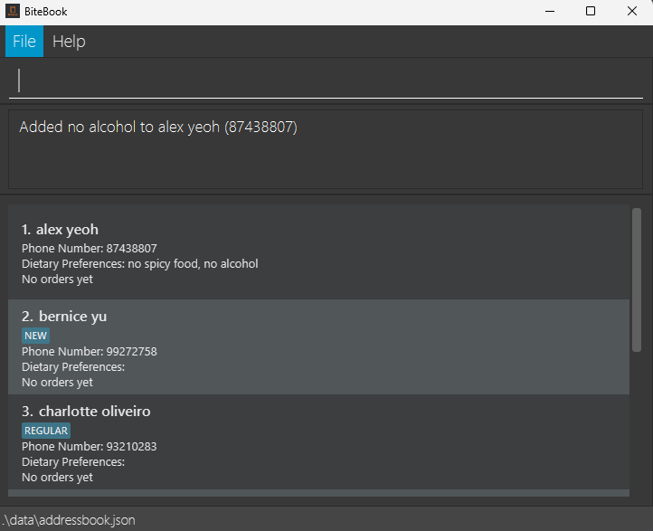

### Finding customers by dietary preferences : `findPreferences`

Finds all customers that has a preference that matches

Format: `findPreferences PREFERENCE`

> 📝 **Note**
> * Lists all customers that have `PREFERENCE` saved as their dietary preference.
> * Only dietary preferences are searched.

> 💡 **Tip**
> 
> The search is case-insensitive. e.g. `No SeAfoOD` will match `no seafood`

> ❗ **Warning**
> 
>  The search is space-sensitive. e.g. `no seafood` will not match with `noseafood` or with extra spaces like `no seafood`.

Examples:
* `findPreferences no alcohol`

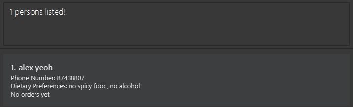

### Adding a customer's past orders : `addOrder`

Adds an order to the customer’s order history.

Format: `addOrder INDEX d/DISH_NAME`

> 📝 **Note** 
> 
> * Adds the order to the person at the specified `INDEX`.
> * The index **must be a positive integer** 1, 2, 3, …​
> * The order **must be a non-empty string**.
> * The order of the keywords matter. e.g. `Milo Iced` will not match `Iced Milo`

> 💡 **Tip**
> 
> * The order is case-insensitive. e.g. `milo` will match `Milo`
> * Top 3 dishes ordered based on order count will be displayed. In the event of a tie that dish that appears in the top 3 first remains there until it is dethroned.
> * If more than one dish is provided, only the last dish will be saved.

> ❗ **Warning**
> 
> * The index refers to the index number shown in the displayed person list.
> * The order is space-sensitive, except for multiple spaces. e.g. `Chicken Rice` will not match 'ChickenRice' but will match ` Chicken     Rice `
> * Only dishes with every word the same will be matched e.g. `ChickenRice` will not match `Chicken`

Examples:
* `list` followed by `addOrder 2 d/milo` adds `milo` to the past orders of the 2nd person in the address book.
* `addOrder 1 d/Iced Milo d/Chicken Rice` adds `Chicken Rice` to the past orders of the 1st person in the address book.

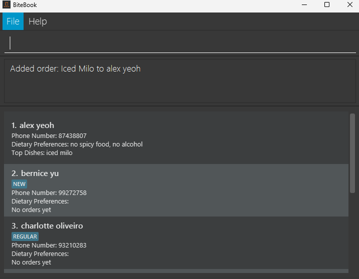

### Viewing a customer's past orders : `viewOrders`

Format: `viewOrders INDEX`

> 📝 **Note**
> * Views the past orders of the person at the specified `INDEX`.
> * The index **must be a positive integer** 1, 2, 3, …​

> ❗ **Warning**
> 
> The index refers to the index number shown in the displayed person list.

Examples:
* `list` followed by `viewOrders 1` views the past orders of the 1st person in the address book.

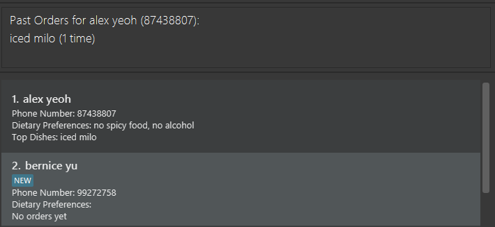

### Finding customers by past orders: `findOrders`

Finds persons whose past orders contain the given keyword.

Format: `findOrders KEYWORD`

> 📝 **Note**
> * The search is case-insensitive. e.g `milo` will match `Milo`
> * The order of the keywords matter. e.g. `Milo Iced` will not match `Iced Milo`
> * Only the orders are searched.
> * Only customers with a dish containing the whole keyword will be matched.

Examples:
* `find milo` returns `John` and `Alice` who both ordered `milo`

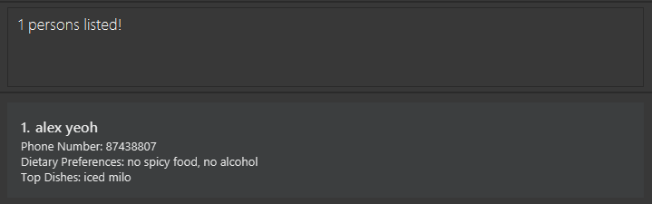
### Clearing all entries : `clear`
Clears all entries from the address book.

> ⚠️ **Danger**
>
> **Deletion is irreversible!** Only use this command if you are sure that all the data is no longer needed

Format: `clear`

### Exiting the program : `exit`
Exits the program.
Format: `exit`

### Saving the data

BiteBook data are saved automatically after any command that changes the data.

### Editing the data file

BiteBook data are saved in `[JAR file location]/data/BiteBook.json`.

> ⚠️ **Danger**
>
> * If your changes to the data file make its format invalid, BiteBook will discard all data and start with an empty data file at the next run. Hence, it is recommended to take a backup of the file before editing it. 
> * Furthermore, certain edits can cause the BiteBook to behave in unexpected ways (e.g., if a value entered is outside the acceptable range). Therefore, edit the data file only if you are confident that you can update it correctly.

### Archiving data files `[coming in v2.0]`

_Details coming soon ..._

--------------------------------------------------------------------------------------------------------------------

## FAQ

**Q**: How do I transfer my data to another Computer? 
**A**: Install the app in the other computer and copy the data file over.

--------------------------------------------------------------------------------------------------------------------

## Known issues

1. **When using multiple screens**, if you move the application to a secondary screen, and later switch to using only the primary screen, the GUI will open off-screen. The remedy is to delete the `preferences.json` file created by the application before running the application again.
2. **If you minimize the Help Window** and then run the `help` command (or use the `Help` menu, or the keyboard shortcut `F1`) again, the original Help Window will remain minimized, and no new Help Window will appear. The remedy is to manually restore the minimized Help Window.

--------------------------------------------------------------------------------------------------------------------

## Command summary

| Action              | Format, Examples                                                                          |
|---------------------|-------------------------------------------------------------------------------------------|
| **Add**             | `add n/NAME p/PHONE_NUMBER [t/TAG] [s/PREFERENCE]`   e.g., `add n/James Ho p/22224444` |
| **Delete**          | `delete INDEX`  e.g., `delete 3`                                                       |
| **Tag**             | `tag INDEX t/TAG`  e.g.,`tag 1 t/VIP`                                                  |
| **Find tag**        | `findTag TAG`  e.g., `findTag VIP`                                                     |
| **Save preference** | `savePreference INDEX s/PREFERENCE`  e.g., `savePreference 1 s/No seafood`             |
| **Find**            | `find KEYWORD [MORE_KEYWORDS]`   e.g., `find john`                                     |
| **Find preference** | `findPreferences PREFERENCE`  e.g., `findPreferences No seafood`                       |
| **Add order**       | `addOrder INDEX d/DISH`  e.g., `addOrder 1 d/Chicken Rice`                             |
| **View orders**     | `viewOrders INDEX`   e.g., `viewOrders 1`                                              |
| **Find orders**     | `findOrders KEYWORD`   e.g., `findOrders milo`                                         |
| **Clear**           | `clear`                                                                                   |
| **Exit**            | `exit`                                                                                    |
| **Help**            | `help`                                                                                    |
