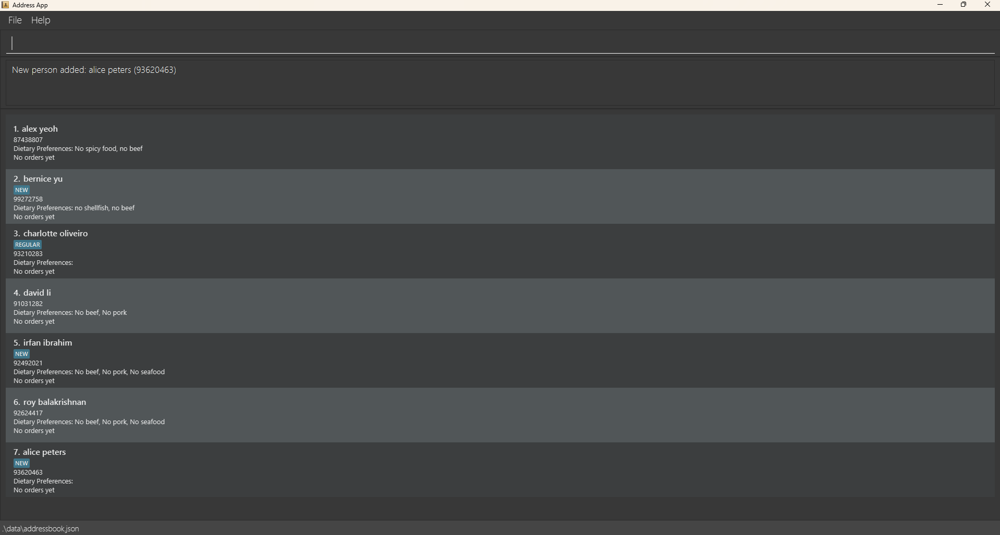

# BiteBook

BiteBook is a powerful desktop application designed to help restaurant owners keep 
track of customer details, enhancing both service quality and customer relationships. 
By storing essential information such as contact details, dining preferences, and visit history, 
BiteBook enables restaurants to personalize the dining experience, improve customer satisfaction, 
and build long-term loyalty. With an intuitive interface and efficient management tools, 
BiteBook makes it easy to maintain a growing customer base while delivering exceptional service.
* If you are interested in using BiteBook, head over to the [_Quick Start_ section of the **User Guide**](UserGuide.html#quick-start).
* If you are interested about developing BiteBook, the [**Developer Guide**](DeveloperGuide.html) is a good place to start.

**Acknowledgements**

* Libraries used: [JavaFX](https://openjfx.io/), [Jackson](https://github.com/FasterXML/jackson), [JUnit5](https://github.com/junit-team/junit5)
