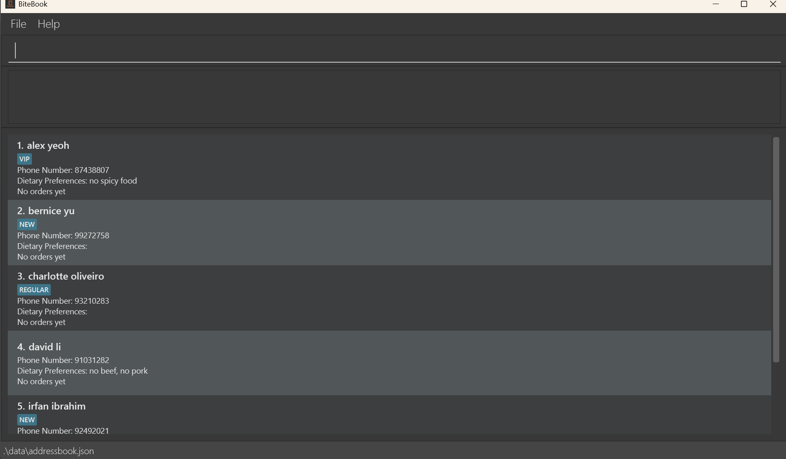

# BiteBook

**BiteBook is a desktop application to help restaurant owners keep track of customers to improve the quality of service. Regulars can contact their favourite restaurant easily and restaurant owners can improve relationships with them by tracking their preferences.

* If you are interested in using BiteBook, head over to the [_Quick Start_ section of the **User Guide**](UserGuide.html#quick-start).
* If you are interested about developing BiteBook, the [**Developer Guide**](DeveloperGuide.html) is a good place to start.

**Acknowledgements**

* Libraries used: [JavaFX](https://openjfx.io/), [Jackson](https://github.com/FasterXML/jackson), [JUnit5](https://github.com/junit-team/junit5)
